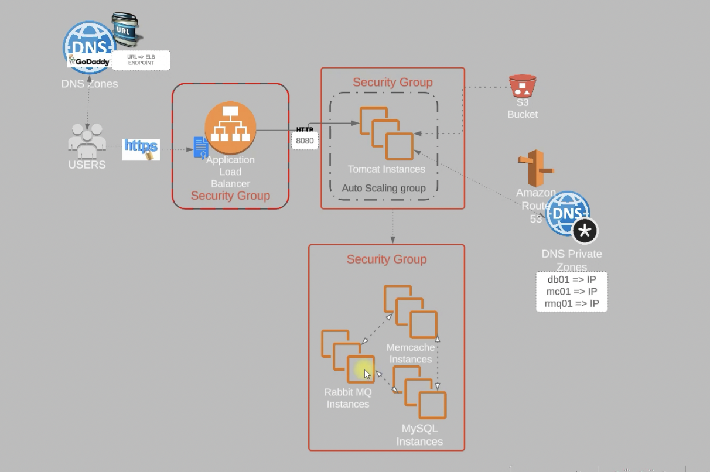
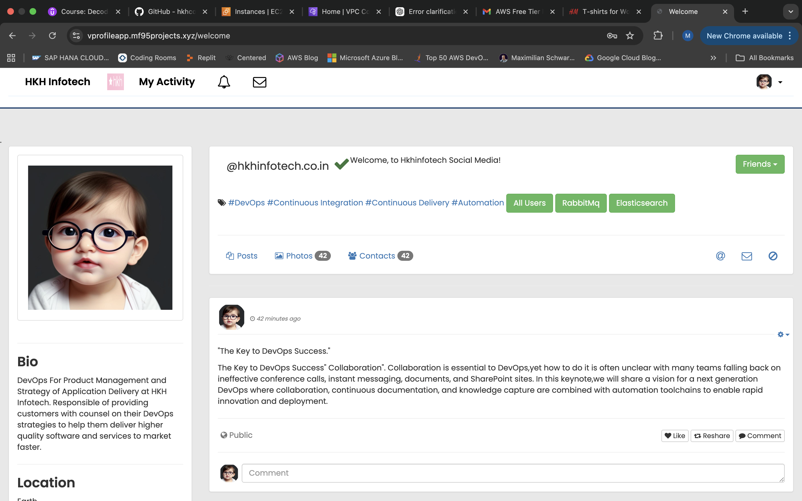
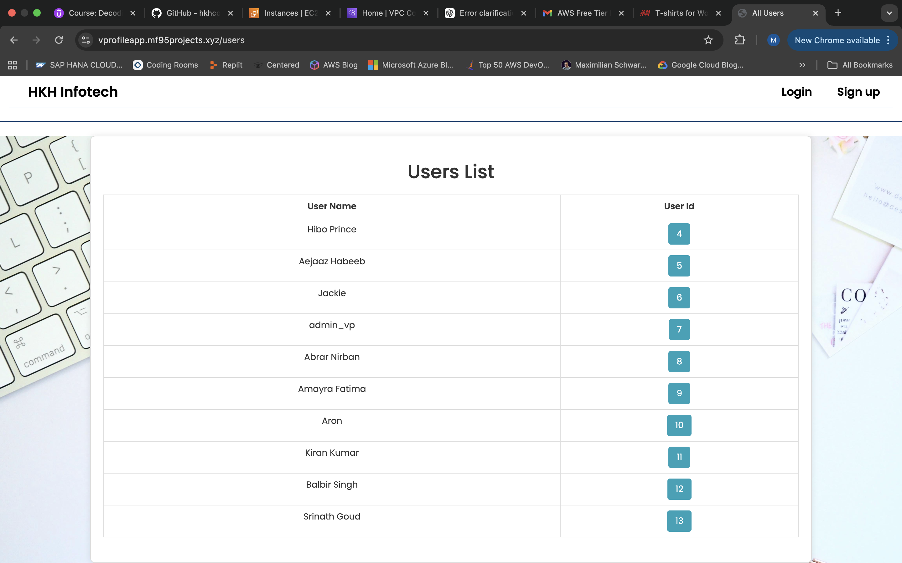

# Production-Ready-Multi-Tier-DevOps-Deployment-on-AWS(Manual)

NGINX + Tomcat + RabbitMQ + MariaDB | EC2 | ELB | ASG | ACM | S3 

📌 Overview
This project demonstrates a highly available, scalable multi-tier application deployment on AWS Cloud using DevOps best practices.
The system is architected with separate layers for web, application, messaging, and database services, deployed across multiple EC2 instances with load balancing, auto scaling, and secure HTTPS access.

🧠 What I Implemented (Key Highlights)
•	Designed and deployed a 4-tier architecture
•	Provisioned infrastructure using Vagrant (for base setup & reproducibility)
•	Deployed services on AWS EC2 instances
•	Configured:
o	Reverse proxy using NGINX
o	Application layer using Apache Tomcat
o	Messaging queue using RabbitMQ
o	Database using MariaDB
•	Implemented Elastic Load Balancer (ELB) for traffic distribution
•	Enabled Auto Scaling Group (ASG) for high availability
•	Secured application with HTTPS using AWS Certificate Manager (ACM)
•	Used S3 for shared storage / artifact management
•	Configured Security Groups & networking between tiers
•	Ensured end-to-end communication across services




```
☁️ AWS Services Used
•	EC2 (compute instances)
•	ELB (Application Load Balancer)
•	ASG (Auto Scaling Group)
•	ACM (SSL/TLS certificate management)
•	S3 (storage)
•	Security Groups (firewall rules)
```
```
⚙️ Tech Stack
•	AWS Cloud
•	EC2 Servers -- Linux (Ubuntu/CentOS)
•	NGINX
•	Apache Tomcat
•	RabbitMQ
•	MariaDB
•	Bash Scripting
```
```
📁 Project Structure
multi-tier-devops-aws/
 ├── scripts/
 │    ├── nginx.sh
 │    ├── tomcat.sh
 │    ├── rabbitmq.sh
 │    ├── mariadb.sh
 ├── app/
 ├── infrastructure/
 │    ├── asg-config/
 │    ├── elb-config/
 ├── README.md
```

🚀 Deployment Steps:

1️⃣ Clone the repository
git clone <your-repo-url>
cd multi-tier-devops-aws

2️⃣ Provision base setup

3️⃣ Deploy on AWS

•	Launch EC2 instances for each tier


•	Configure Security Groups


•	Attach instances to ELB


•	Setup ASG for scaling


•	Configure ACM for HTTPS


•	Upload artifacts to S3


```
🔐 Security Implementation
•	HTTPS enabled via ACM
•	Controlled access using Security Groups
•	Tier-based isolation (web/app/db separation)
```

🌐 Access
•	Application URL: https://vprofileapp.mf95projects.xyz






Load Balanced via ELB

