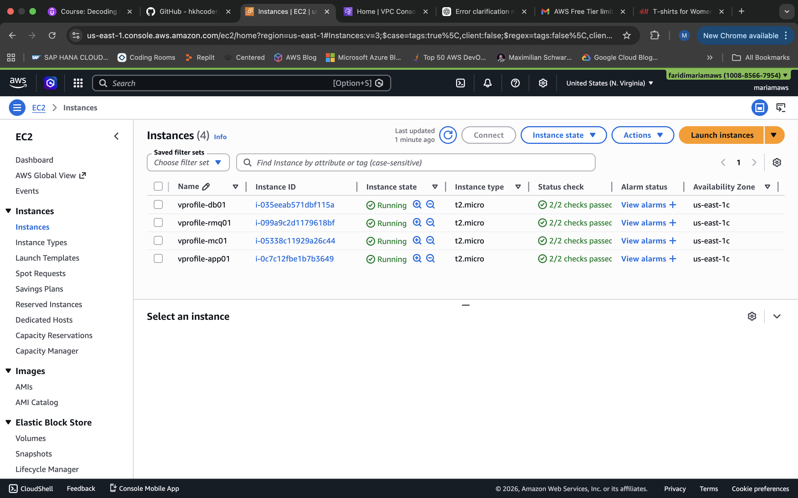
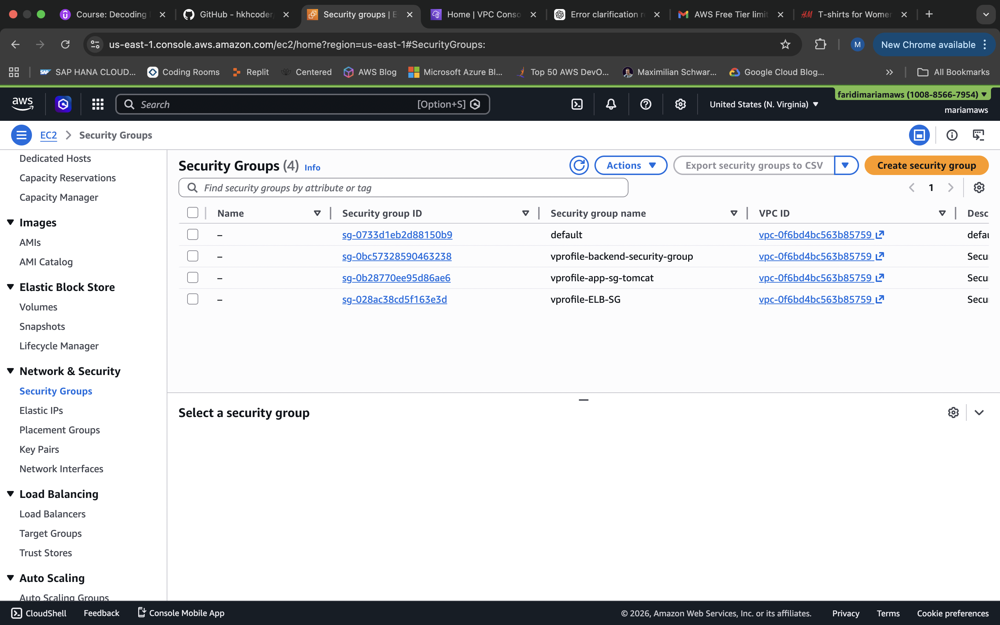
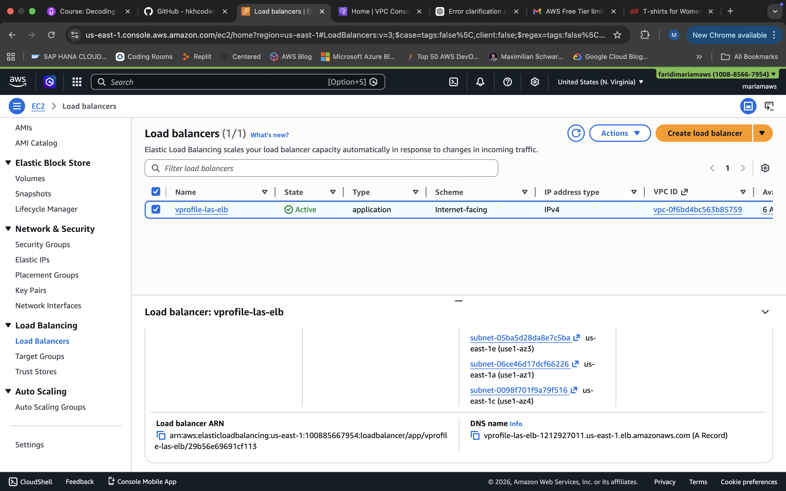
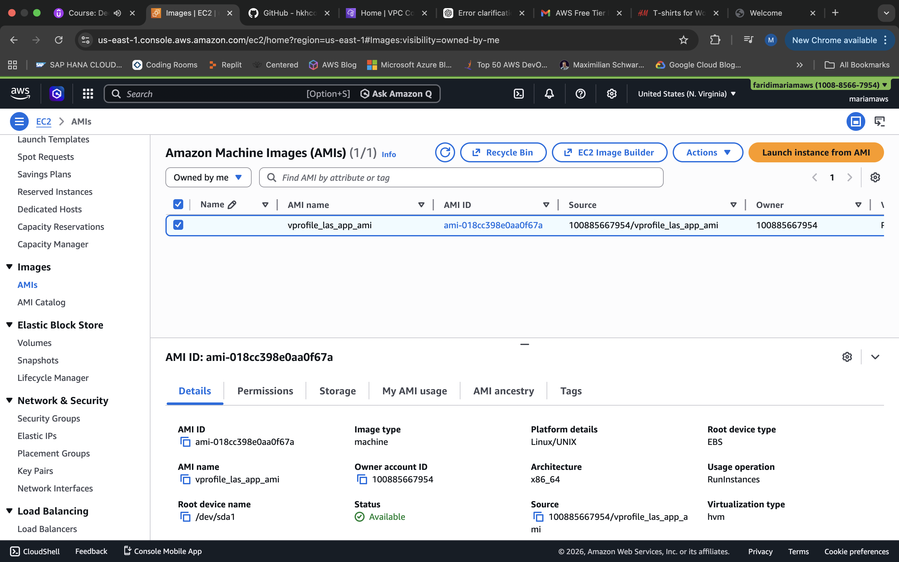
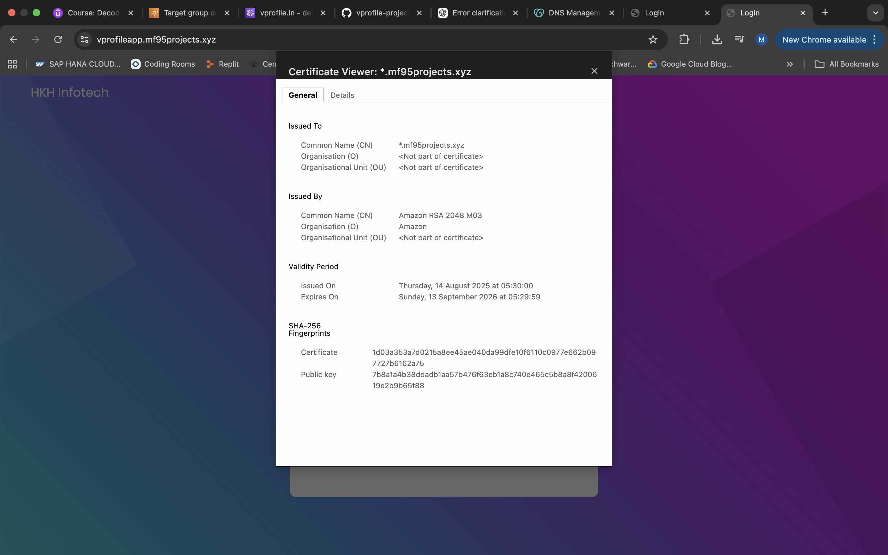
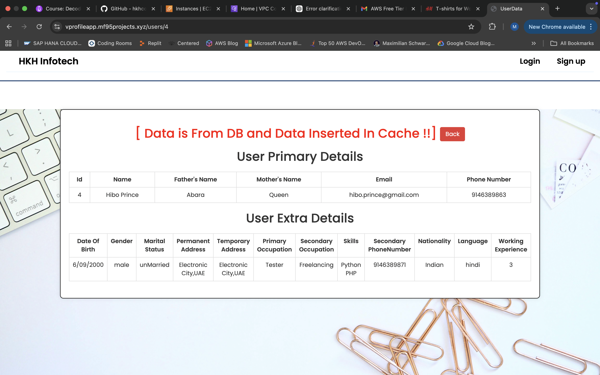
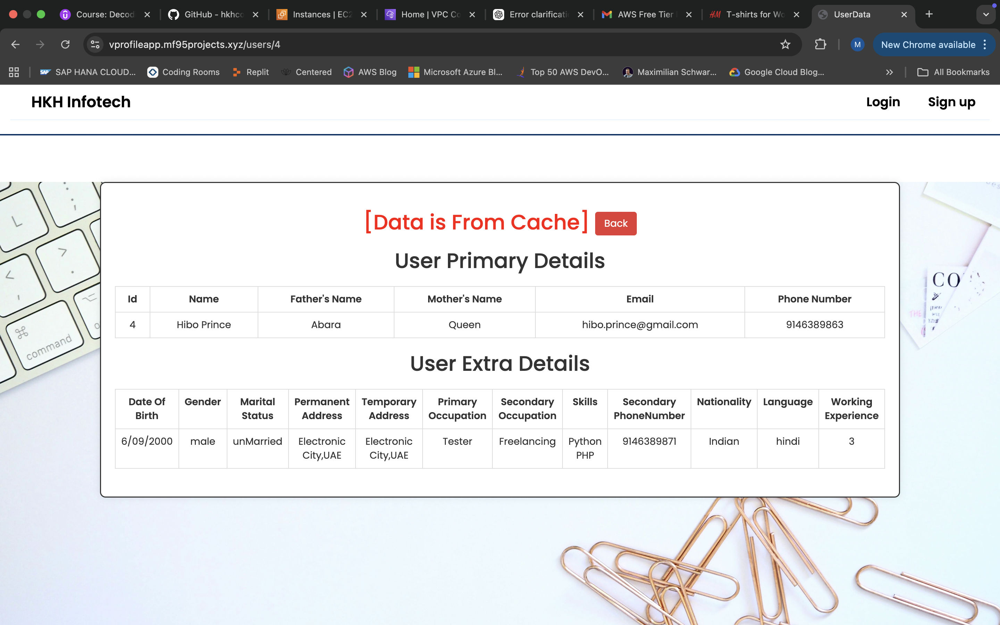
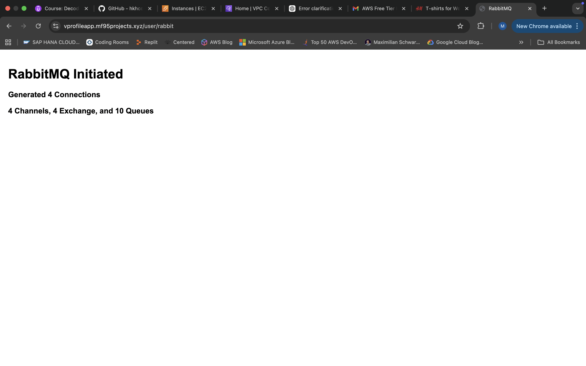

# Production-Ready-Multi-Tier-DevOps-Deployment-on-AWS(Manual)

NGINX + Tomcat + RabbitMQ + MariaDB | EC2 | ELB | ASG | ACM | S3 

📌 Overview
This project demonstrates a highly available, scalable multi-tier application deployment on AWS Cloud using DevOps best practices.
The system is architected with separate layers for web, application, messaging, and database services, deployed across multiple EC2 instances with load balancing, auto scaling, and secure HTTPS access.

🧠 What I Implemented (Key Highlights)
•	Designed and deployed a 4-tier architecture
•	Provisioned infrastructure using Vagrant (for base setup & reproducibility)
•	Deployed services on AWS EC2 instances
•	Configured:
o	Reverse proxy using NGINX
o	Application layer using Apache Tomcat
o	Messaging queue using RabbitMQ
o	Database using MariaDB
•	Implemented Elastic Load Balancer (ELB) for traffic distribution
•	Enabled Auto Scaling Group (ASG) for high availability
•	Secured application with HTTPS using AWS Certificate Manager (ACM)
•	Used S3 for shared storage / artifact management
•	Configured Security Groups & networking between tiers
•	Ensured end-to-end communication across services


```
☁️ AWS Services Used
•	EC2 (compute instances)
•	ELB (Application Load Balancer)
•	ASG (Auto Scaling Group)
•	ACM (SSL/TLS certificate management)
•	S3 (storage)
•	Security Groups (firewall rules)
```
```
⚙️ Tech Stack
•	AWS Cloud
•	EC2 Servers -- Linux (Ubuntu/CentOS)
•	NGINX
•	Apache Tomcat
•	RabbitMQ
•	MariaDB
•	Bash Scripting
```
```
📁 Project Structure
multi-tier-devops-aws/
 ├── scripts/
 │    ├── nginx.sh
 │    ├── tomcat.sh
 │    ├── rabbitmq.sh
 │    ├── mariadb.sh
 ├── app/
 ├── infrastructure/
 │    ├── asg-config/
 │    ├── elb-config/
 ├── README.md
```

🚀 Deployment Steps:

1️⃣ Clone the repository
git clone <your-repo-url>
cd multi-tier-devops-aws

2️⃣ Provision base setup

3️⃣ Deploy on AWS

•	Launch EC2 instances for each tier



•	Configure Security Groups



•	Attach instances to ELB



•	Setup ASG for scaling


•	Configure ACM for HTTPS



•	Upload artifacts to S3


Phase 1 — AWS Setup: Create an S3 bucket to store artifacts. Create an IAM user with S3 full access and generate access keys (stored on your laptop for CLI authentication). Create an IAM role with S3 full access and attach it to the Tomcat EC2 instance (so the server can pull artifacts without needing hardcoded keys).

Phase 2 — Build on local machine: Verify Maven, JDK 17, and AWS CLI are installed. Update `application.properties` with correct backend hostnames (DB, Memcache, RabbitMQ via Route 53 records). Run `mvn install` to build the `vprofile-v2.war` artifact. Configure AWS CLI with the IAM access keys (`aws configure`). Push the artifact to S3 using `aws s3 cp`.

Phase 3 — Deploy on Tomcat EC2: SSH into the app server. Install AWS CLI via snap. Pull the artifact from S3 to `/tmp/`. Stop Tomcat, remove the default ROOT app, copy the `.war` as `ROOT.war`, and start Tomcat — which auto-extracts and serves the app.You can click any box in the diagram to ask a deeper question about that step. Here's the complete flow in a nutshell:

AWS Setup creates the storage (S3 bucket), the authentication for your laptop (IAM user + access keys), and the authentication for the server (IAM role attached to EC2) — all before a single line of code is built.

Local Build verifies your tools, updates the backend config, runs `mvn install` to produce the `.war` file, configures AWS CLI with your keys, then pushes the artifact to S3.

EC2 DeploySSHes into the Tomcat server, installs AWS CLI, pulls the `.war` from S3, replaces the default Tomcat ROOT app with your artifact, and restarts Tomcat to serve the application.


```
🔐 Security Implementation
•	HTTPS enabled via ACM
•	Controlled access using Security Groups
•	Tier-based isolation (web/app/db separation)
```

🌐 Access
•	Application URL: https://vprofileapp.mf95projects.xyz









Load Balanced via ELB

